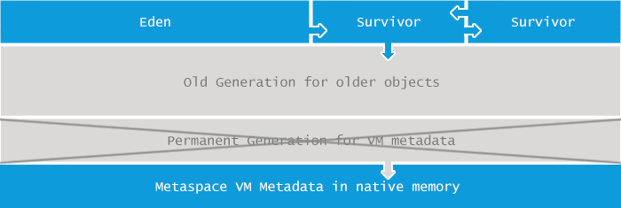

# java.lang.OutOfMemoryError: **Metaspace**

# OutOfMemoryError系列（4）: Metaspace

Java applications are allowed to use only a limited amount of memory. The exact amount of memory your particular application can use is specified during application startup. To make things more complex, Java memory is separated into different regions, as seen in the following figure:

JVM有最大内存限制, 通过修改启动参数可以改变这些值。Java将堆内存划分为多个部分, 如下图所示:





The size of all those regions, including the metaspace area, can be specified during the JVM launch. If you do not determine the sizes yourself, platform-specific defaults will be used.

这些区域的最大值, 由JVM启动参数 `-Xmx` 和 `-XX:MaxPermSize` 指定. 如果没有明确指定, 则根据操作系统平台和物理内存的大小来确定。
所有这些区域的大小,包括metaspace区域,可以指定在JVM启动。如果你不确定大小,将使用特定于平台的违约。

The _java.lang.OutOfMemoryError: Metaspace_ message indicates that the Metaspace area in memory is exhausted.

_java.lang。OutOfMemoryError:Metaspace_消息表明Metaspace区域内存耗尽。

## What is causing it?

## 是由什么原因导致的?

If you are not a newcomer to the Java landscape, you might be familiar with another concept in Java memory management called PermGen. Starting from Java 8, the memory model in Java was significantly changed. A new memory area called Metaspace was introduced and Permgen was removed. This change was made due to variety of reasons, including but not limited to:

如果你不是一个新人到Java景观,你可能会熟悉Java内存管理的另一个概念叫做PermGen.从Java 8开始,Java内存模型的显著改变。介绍了一个新的内存区域叫做Metaspace Permgen被删除.这种变化是由于各种各样的原因,包括但不限于:

*   The required size of permgen was hard to predict. It resulted in either under-provisioning triggering [java.lang.OutOfMemoryError: Permgen size](http://www.plumbr.eu/outofmemoryerror/permgen-space) errors or over-provisioning resulting in wasted resources.

*所需的大小permgen是很难预测的。它导致触发[. lang供给不足。OutOfMemoryError:Permgen大小](http://www.plumbr.欧盟/ outofmemoryerror / permgen空间)错误或过度供应导致资源浪费。

*   [GC performance](https://plumbr.eu/handbook/gc-tuning/gc-tuning-in-practice) improvements, enabling concurrent class data de-allocation without [GC pauses](https://plumbr.eu/handbook/garbage-collection-algorithms-implementations) and specific iterators on metadata

*(GC性能)(https://plumbr.eu/handbook/gc-tuning/gc-tuning-in-practice)的改进,使并发类数据中没有GC暂停(https://plumbr.欧盟/手册/ garbage-collection-algorithms-implementations)和元数据的具体迭代器

*   Support for further optimizations such as [G1](https://plumbr.eu/handbook/garbage-collection-algorithms-implementations/g1) concurrent class unloading.

*支持等进一步优化(G1)(https://plumbr.eu/handbook/garbage-collection-algorithms-implementations/g1)并发类卸载。

So if you were familiar with PermGen then all you need to know as background is that – whatever was in PermGen before Java 8 (name and fields of the class, methods of a class with the bytecode of the methods, constant pool, JIT optimizations etc) – is now located in Metaspace.

如果你熟悉PermGen那么所有你需要知道背景是——不管在PermGen Java 8(名称和类的字段,方法类的字节码方法,常量池,JIT优化等)——现在位于Metaspace。

As you can see, Metaspace size requirements depend both upon the number of classes loaded as well as the size of such class declarations. So it is easy to see the **main cause for the _java.lang.OutOfMemoryError: Metaspace_ is: either too many classes or too big classes being loaded to the Metaspace.**

如您所见,Metaspace大小需求都依赖于装载的类的数量等大小的类声明。所以很容易看到* * _java.lang的主要原因.OutOfMemoryError:Metaspace_是:太多的类或类被加载到Metaspace太大。* *

## Give me an example

## 示例

As we explained in the previous chapter, Metaspace usage is strongly correlated with the number of classes loaded into the JVM. The following code serves as the most straightforward example:

正如我们在前一章解释,Metaspace使用强烈的数量与类装载到JVM中。下面的代码是最简单的例子:

```
public class Metaspace {
  static javassist.ClassPool cp = javassist.ClassPool.getDefault();

  public static void main(String[] args) throws Exception{
    for (int i = 0; ; i++) { 
      Class c = cp.makeClass("eu.plumbr.demo.Generated" + i).toClass();
    }
  }
}
```


In this example the source code iterates over a loop and generates classes at the runtime. All those generated class definitions end up consuming Metaspace. Class generation complexity is taken care of by the [javassist](http://www.csg.ci.i.u-tokyo.ac.jp/~chiba/javassist/) library.

在这个例子的源代码循环遍历并生成类在运行时。所有这些最终消费Metaspace生成的类定义.类生成的复杂性是照顾[javassist](http://www.csg.ci.i.u-tokyo.ac.jp/ ~千叶/ javassist /)图书馆。

The code will keep generating new classes and loading their definitions to Metaspace until the space is fully utilized and the _java.lang.OutOfMemoryError: Metaspace_ is thrown. When launched with _-XX:MaxMetaspaceSize=64m_ then on Mac OS X my Java 1.8.0_05 dies at around 70,000 classes loaded.

代码将生成新类和加载它们的定义Metaspace直到空间得到充分利用,并且_java.lang。抛出OutOfMemoryError:Metaspace_.当推出_-XX:MaxMetaspaceSize = 64 m_然后在Mac OS X上我的Java 1.8.0_05死亡约70000类加载。

## What is the solution?

## 解决方案

The first solution when facing the OutOfMemoryError due to Metaspace should be obvious. If the application exhausts the Metaspace area in the memory you should increase the size of Metaspace. Alter your application launch configuration and increase the following:

第一个解决方案当面对OutOfMemoryError由于Metaspace应该是显而易见的。如果应用程序耗尽Metaspace区域的内存应该增加Metaspace的大小.改变你的应用程序启动配置,增加以下:

`-XX:MaxMetaspaceSize=512m`

“- xx:MaxMetaspaceSize = 512”

The above configuration example tells the JVM that Metaspace is allowed to grow up to 512 MB before it can start complaining in the form of _OutOfMemoryError_.

上面的配置例子告诉JVM Metaspace可以长到512 MB才能开始抱怨_OutOfMemoryError_的形式。

Another solution is even simpler at first sight. You can remove the limit on Metaspace size altogether by deleting this parameter. But pay attention to the fact that by doing so you can introduce heavy swapping and/or reach native allocation failures instead.

另一个解决方案是更简单的一见钟情。您可以删除限制Metaspace大小完全删除这个参数.但注意通过这样做你可以介绍重型交换和/或达到本地分配失败。

Before calling it a night though, be warned – more often than not it can happen that by using the above recommended “quick fixes” you end up masking the symptoms by hiding the _java.lang.OutOfMemoryError: Metaspace_ and not tackling the underlying problem. If your application leaks memory or just loads something unreasonable into Metaspace the above solution will not actually improve anything, it will just postpone the problem.

之前调用它一晚,被警告——往往会发生,通过使用上述推荐的“快速修复”你最终掩盖隐藏_java.lang的症状.OutOfMemoryError:Metaspace_,不解决根本问题.如果您的应用程序内存泄漏或仅仅是不合理的东西装入Metaspace上面的解决方案不会真正改善什么,它只会推迟这一问题。


原文链接: <https://plumbr.eu/outofmemoryerror/permgen-space>


